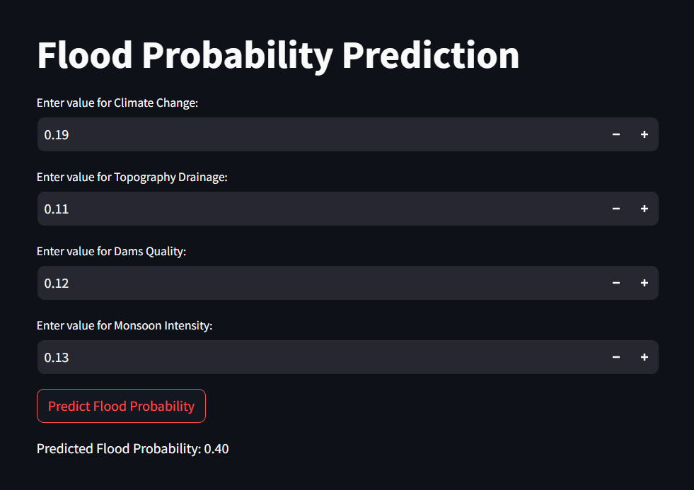

# Flood Probability Prediction Project

## Overview
This project was developed during my summer internship in 2024. The goal was to create a machine learning model that predicts the probability of flooding based on factors such as climate change, topography drainage, dam quality, and monsoon intensity. The project utilizes Python, `scikit-learn` for building the prediction model, and Streamlit to create an interactive web interface for predictions.

## Project Files
- **`flood_model.py`**: This script loads the dataset, trains a linear regression model, and saves the trained model to a `.pkl` file.
- **`app.py`**: This script creates a Streamlit-based web app where users can input values for climate change, topography drainage, dam quality, and monsoon intensity to predict the probability of a flood.
- **`flood_prediction_model.pkl`**: The trained model file.
- **`flood.csv`**: The dataset used to train the model.

## Dataset
The dataset (`flood.csv`) contains the following features:
- **ClimateChange**: A value indicating the impact of climate change.
- **TopographyDrainage**: A value representing the quality of drainage due to topography.
- **DamsQuality**: A measure of dam infrastructure quality.
- **MonsoonIntensity**: A value indicating the intensity of the monsoon season.
- **FloodProbability**: The target variable representing the probability of a flood.

## Project Workflow

1. **Data Loading and Preprocessing**:  
   The dataset is loaded, and relevant features are selected: Climate Change, Topography Drainage, Dams Quality, and Monsoon Intensity. The target variable is Flood Probability.

2. **Model Training**:  
   A Linear Regression model is trained using `scikit-learn`. The data is split into training and test sets (80% training, 20% testing). After training, the model is saved as `flood_prediction_model.pkl` using `joblib`.

3. **Web Application**:  
   The web app is built using Streamlit, allowing users to input values for climate change, topography drainage, dam quality, and monsoon intensity. The app then predicts the flood probability based on the input.

---

## Flood Probability Prediction Output

Below is an example of the web application after predicting flood probability based on user input:



---

## How to Run

### 1. Clone the Repository
```bash
git clone https://github.com/Parshuramsingh013/flood-probability-prediction.git


